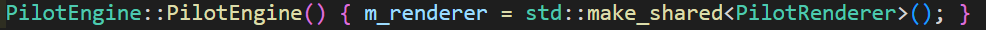
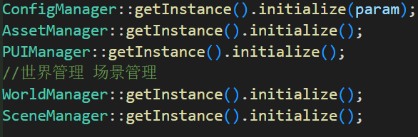
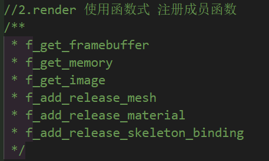
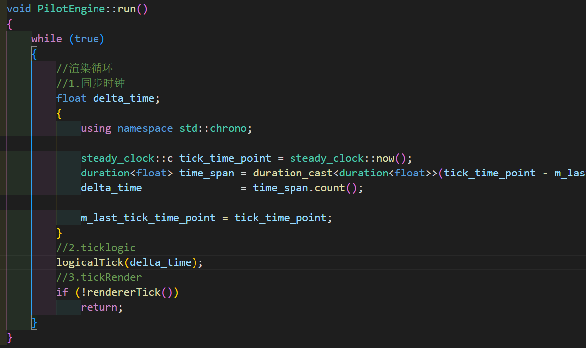
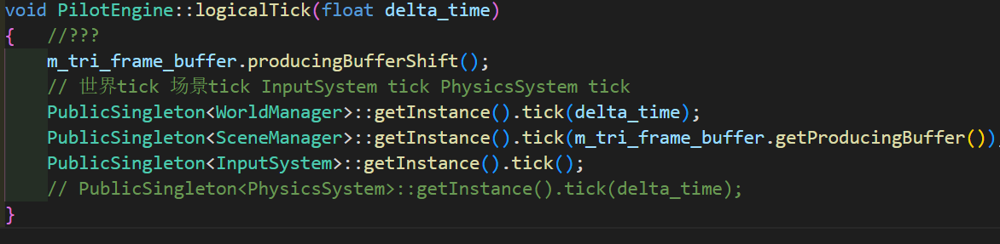
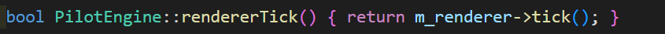

### 引擎`PilotEngine`

#### 构造

初始化render



#### start

初始化 manager

- `SceneManager`
- 



将函数注册道 renderer

> 最重要renderer注册函数是最重要的



#### run

渲染循环

1.同步时钟

2.ticklogic

3.tickrender



#### logicalTick



- GObject
    - <容器>component
        - 子类animation
        - 子类 camera
        - 子类 Mesh
        - 子类 motor
        - 子类 rigidbody
        - 子类 transform

- `Scene`
    - `camera`

- `GameCommand`


- `wordldManager`->tick

    - `Level`->load

        - 创建 `GObject`

    - `Level`->tickAll

        - `GObject`->tick

            - <容器>`component`tick
                - 子类`MeshComponent`->tick
                    - `SceneManage`r添加物体
                - 子类`CameraComponent`->tick

        - > SceneManager::syncSceneObjects 同步什么意思?
            >
            > - ...

- `SceneManager`->tick

    - buffer->m_uistate->m_editor_camera = m_scene->m_camera;

- `InputSyste`->tick

    - 根据鼠标移动计算转角度
    - `SurfaceIO`注册**Onkey OnCursor**函数

- `PhysicsSystem`->tick

#### rendererTick



### render`PilotRenderer`

tick

```js
//Surface
m_surface.tick(handles)
//添加handle
f_add_release_mesh(handle);
f_add_release_material(handle);
f_add_release_skeleton_binding(handle);
```

- `Surface`->tick
    - `SurfaceIO`->tick_NotQuit
    - `SurfaceRHI` pretick
    - `SurfaceUI`pretick
    - `SurfaceUI` posttick
    - `SurfaceRHI`posttick


